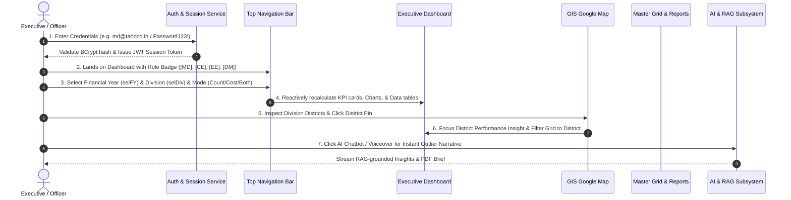

# TAHDCO UNIFIED DASHBOARD PLATFORM (UDP)
## Dashboard End-to-End Flow, User Stories, Click Actions & Acceptance Criteria Document

**Document Reference**: DOC-UDP-FLOW-US-2026-V2.5  
**Target Organization**: Tamil Nadu Adi Dravidar Housing and Development Corporation (TAHDCO)  
**Release**: Production V2.5  
**Date**: August 2026  

---

## TABLE OF CONTENTS
1. [End-to-End Dashboard Step-by-Step Flow](#1-end-to-end-dashboard-step-by-step-flow)
2. [Agile User Stories by Role Persona](#2-agile-user-stories-by-role-persona)
   - 2.1 Managing Director (MD) & Secretary
   - 2.2 Chief Engineer (CE) & General Manager (GM)
   - 2.3 Executive Engineers (EEs)
   - 2.4 District Managers (DMs)
   - 2.5 System Administrator (HQ)
3. [Comprehensive User Click-Action & Interaction Matrix](#3-comprehensive-user-click-action--interaction-matrix)
   - 3.1 Top Navigation Bar Controls
   - 3.2 Geographic GIS Map & 360° Street View Actions
   - 3.3 Executive Metric KPI Cards & 3D Charts
   - 3.4 Master Data Table & Export Actions
   - 3.5 AI Assistant, RAG & Voiceover Controls
   - 3.6 Dynamic Scheduler Management Controls
   - 3.7 Local Body Configuration & Excel Interoperability
   - 3.8 User Master & Privilege Matrix Controls
4. [User Criteria & Acceptance Rules (Gherkin Scenarios)](#4-user-criteria--acceptance-rules)

---

## 1. END-TO-END DASHBOARD STEP-BY-STEP FLOW

The typical executive and operational user journey through the platform follows this structured 7-step flow:



### Detailed Step Breakdown:
1. **Step 1: Secure Authentication**: User logs in with assigned email and password. Backend issues JWT with embedded role and geographic claims (`all`, `division`, `district`).
2. **Step 2: Role-Contextual Landing**: The top bar displays dynamic role branding (`[ADM] Application Admin`, `[MD] Dr. Vijaya Rajan`, `[EE] EE - Coimbatore Division`, etc.).
3. **Step 3: Global Multi-Dimensional Filtering**: User selects Financial Year(s) and Division(s) from the center top bar.
4. **Step 4: Real-Time Recalculation**: All KPI metric cards, donut charts, progress bars, and data tables update in $< 50\text{ ms}$ via client-side reactive state management.
5. **Step 5: Geospatial Inspection**: The dark-vector Google Map filters pins strictly to districts inside the selected divisions and auto-fits the viewport (`fitBounds`).
6. **Step 6: District Deep-Dive**: Clicking a pin opens a stats InfoWindow, highlights the side panel, and filters the master records table.
7. **Step 7: AI Executive Summary & PDF Briefing**: User triggers AI Voiceover or RAG search to inspect outliers and downloads a branded PDF report.

---

## 2. AGILE USER STORIES BY ROLE PERSONA

### 2.1 Managing Director (MD) & Secretary (Statewide Governance)
* **`US-MD-001`**: *As the Managing Director*, I want to see real-time statewide counts and expenditure across all 8 TAHDCO programs, so that I can report physical and financial progress to the State Government.
* **`US-MD-002`**: *As the Secretary to Government*, I want to toggle between `# Count`, `₹ Cost`, and `⊶ Both` view modes, so that I can evaluate both volume and budgetary utilization simultaneously.
* **`US-MD-003`**: *As the Managing Director*, I want to listen to automated AI voiceovers, so that I can get rapid spoken executive briefings during high-level meetings.

### 2.2 Chief Engineer (CE) & General Manager (GM) (Statewide Departmental)
* **`US-CE-001`**: *As the Chief Engineer*, I want to monitor TIPS work orders, pending M-Books, and THMS housing stages statewide, so that I can resolve engineering bottlenecks.
* **`US-GM-001`**: *As the General Manager (Welfare)*, I want to track TELP loan sanctions, TAHDCO scheme applications, and TAMS student enrollments, so that welfare benefits reach eligible beneficiaries without delay.

### 2.3 Executive Engineers (EEs) (Divisional Jurisdiction)
* **`US-EE-001`**: *As an Executive Engineer*, I want the dashboard to automatically scope my view to my assigned Division (e.g. Coimbatore Division), so that I only focus on works under my jurisdiction.
* **`US-EE-002`**: *As an Executive Engineer*, I want to see CCTV camera uptime on Patrol360 across my division's construction sites, so that site security is maintained.

### 2.4 District Managers (DMs) (District Jurisdiction)
* **`US-DM-001`**: *As a District Manager*, I want to see beneficiary applications and local body distribution in my district, so that scheme disbursements meet annual targets.
* **`US-DM-002`**: *As a District Manager*, I want to export my district's local body mappings to Excel, so that block officers can verify habitations locally.

### 2.5 System Administrator (HQ)
* **`US-ADM-001`**: *As the System Administrator*, I want to manage automated cron synchronizers and view date-filtered execution histories, so that upstream data feeds remain 100% reliable.
* **`US-ADM-002`**: *As the System Administrator*, I want to configure per-user project privilege matrices (View/Create/Edit/Update/Delete), so that data access follows strict compliance rules.

---

## 3. COMPREHENSIVE USER CLICK-ACTION & INTERACTION MATRIX

### 3.1 Top Navigation Bar Controls

| UI Component | User Action | Trigger / Event | System Reaction & Outcome |
| :--- | :--- | :--- | :--- |
| **Financial Year Dropdown** | Click & Select Year(s) | `onChange` / `(ngModelChange)` | Emits `DataService.setGlobalFilters`. Recalculates all dashboard figures for selected FYs. |
| **Division Dropdown** | Click & Select Division(s)| `onChange` / `(ngModelChange)` | Filters metrics, updates table rows, and filters Google Map pins strictly to selected divisions. |
| **View Mode Pill Buttons** | Click `# Count`, `₹ Cost`, or `⊶ Both` | `(click)="setViewMode(mode)"` | Toggles display units across all metric cards and table columns. |
| **AI Analytics Button** | Click ✨ AI Analytics | `(click)="openAiModal()"` | Opens AI Assistant modal for natural-language Q&A and RAG knowledge search. |
| **User Profile / Logout** | Click User Avatar $\rightarrow$ Logout | `(click)="logout()"` | Clears JWT session tokens from `localStorage` and redirects to `/login`. |

---

### 3.2 Geographic GIS Map & 360° Street View Actions

| UI Component | User Action | Trigger / Event | System Reaction & Outcome |
| :--- | :--- | :--- | :--- |
| **Map Division Isolation** | Select Division in Top Bar | Reactive Filter Stream | Google Maps re-renders pins **strictly for districts in the selected divisions**. |
| **Viewport Auto-Fit** | Select Division / Multiple | `fitBounds(LatLngBounds)` | Smoothly zooms and centers map viewport to enclose all visible district markers. |
| **District Pin Marker** | Click on Circle Pin | `marker.addListener('click')`| 1. Opens styled InfoWindow.<br>2. Updates right-hand Performance Card.<br>3. Filters master table to clicked district. |
| **360° Street View Button**| Click 📷 360° Street View | `(click)="openStreetView(district)"` | Opens high-resolution Google Street View panoramic viewer for field inspection. |
| **Map Layer Style Pill** | Click Satellite / Terrain / Dark | `(click)="setMapType(type)"` | Switches Google Map base tile raster to selected satellite/vector theme. |

---

### 3.3 Executive Metric KPI Cards & 3D Charts

| UI Component | User Action | Trigger / Event | System Reaction & Outcome |
| :--- | :--- | :--- | :--- |
| **KPI Card Hover** | Hover mouse over KPI Card | CSS `:hover` transition | Elevates card with soft shadow, reveals sparkline growth metric and delta badge. |
| **Module Deep-Link** | Click KPI Card Action Arrow | `(click)="navigateToReport(id)"`| Directs user to detailed module drilldown page (e.g. `/housing`, `/tender`, `/telp`). |
| **Chart Slice / Bar Click**| Click Donut Slice or Bar | `chartItemClick(event)` | Filters the bottom master table to the clicked stage (e.g. "Roof Level" or "M-Book Pending"). |
| **Voiceover Briefing Pill**| Click 🔊 Voice Summary | `(click)="playVoiceover()"` | Synthesizes real-time spoken briefing of statewide performance and outlier alerts. |

---

### 3.4 Master Data Table & Export Actions

| UI Component | User Action | Trigger / Event | System Reaction & Outcome |
| :--- | :--- | :--- | :--- |
| **Search Input Box** | Type keyword (e.g. "Madurai")| `(input)="filterTable()"` | Instantly filters table rows matching text across all visible columns ($< 10\text{ ms}$). |
| **Column Sorter** | Click column header | `pSortableColumn` | Re-orders rows ascending/descending with visual sort indicator arrow. |
| **Export to Excel** | Click 📊 Export Excel | `(click)="exportExcel()"` | Generates and downloads formatted `.xlsx` spreadsheet using SheetJS. |
| **Export to PDF** | Click 📄 Export PDF | `(click)="exportPdf()"` | Renders and downloads high-resolution executive PDF briefing report. |
| **Row Expand Button** | Click chevron `>` | `(click)="toggleRow(row)"` | Expands inline child table displaying line-item records and habitation milestones. |

---

### 3.5 Dynamic Scheduler Management Controls (`/scheduler-management`)

| UI Component | User Action | Trigger / Event | System Reaction & Outcome |
| :--- | :--- | :--- | :--- |
| **Add Schedule Job** | Click `+ Add Job` | `(click)="openJobModal()"` | Opens modal dialog to configure Job Name, Project, Cron Expression, HTTP Method, and URL. |
| **Run Now Button** | Click ⚡ Run Now | `(click)="runJobNow(job)"` | Sends immediate asynchronous execution request to backend Hangfire worker. |
| **Toggle Job Status** | Click Active/Inactive toggle | `(onChange)="toggleJob(job)"` | Enables or pauses cron trigger in Hangfire scheduler table. |
| **Date Range Filter** | Select Dates in `p-calendar` | `(onSelect)="applyLogFilters()"` | Filters execution history table **strictly to runs within selected start and end dates**. |
| **Clear Filters** | Click 🧹 Clear Filters | `(click)="clearLogFilters()"` | Clears search text, project dropdown, status filter, and date picker back to default. |

---

### 3.6 Local Body Configuration & Excel Interoperability (`/configuration`)

| UI Component | User Action | Trigger / Event | System Reaction & Outcome |
| :--- | :--- | :--- | :--- |
| **Upload Excel Button** | Click 📤 Import Excel | `(change)="onFileChange($event)"` | Client-side SheetJS parses `.xlsx`, validates columns, and displays preview table. |
| **Save Imported Data** | Click 💾 Save Records | `(click)="saveImportedData()"` | Persists validated rows into `local_body_mapping` MySQL table via REST API. |
| **Export Master Button**| Click 📥 Export Excel | `(click)="exportToExcel()"` | Downloads complete 38-district Tamil Nadu local body mapping workbook. |
| **Add Local Body Modal**| Click `+ Add Entry` | `(click)="openAddModal()"` | Opens dialog for entering Division, District, Type, Taluk, Block, and Panchayat. |

---

## 4. USER CRITERIA & ACCEPTANCE RULES (GHERKIN SCENARIOS)

### Scenario 1: Global Division Selection Filters Map and Data Table
```gherkin
Given the user is logged into the TAHDCO Unified Dashboard Platform
When the user selects "Coimbatore" from the Division Multi-Select dropdown
Then the Google Map MUST display markers exclusively for Coimbatore, Erode, Tiruppur, and The Nilgiris
And the Google Map viewport MUST automatically fit bounds to enclose those 4 districts
And all metric cards and the master data table MUST reflect aggregated counts for Coimbatore Division only.
```

### Scenario 2: District Marker Click Action on Geographic Map
```gherkin
Given the Google Map is rendered with active district markers
When the user clicks on the marker for "Madurai District"
Then an InfoWindow MUST open displaying Madurai's real-time physical and financial metrics
And the District Performance Insight side card MUST highlight "Madurai District Overview"
And the Master Data Table below the map MUST filter rows to display records for Madurai.
```

### Scenario 3: Date-Range Filtering on Scheduler Execution History
```gherkin
Given the user is on the "/scheduler-management" page in the "Execution History" tab
When the user selects the date range "01/08/2026" to "15/08/2026" in the p-calendar date picker
Then the log list MUST filter to show only execution runs that occurred between 01-Aug-2026 and 15-Aug-2026
And clicking "Clear Filters" MUST reset the date picker and restore all historical runs.
```

### Scenario 4: Role-Based Scope Enforcement for District Managers
```gherkin
Given a user logs in with credentials "dm_chennai@tahdco.in" / "Password123!"
Then the user MUST be granted the "dm" role with scope "district"
And the dashboard title MUST display "[DM] District Manager - Chennai"
And the user SHALL NOT have permission to edit records outside Chennai District.
```

### Scenario 5: Non-Destructive Cache Fallback on Upstream Failure
```gherkin
Given the system executes an automated sync job for THMS Housing API
When the upstream THMS server responds with HTTP 500 or times out
Then the system MUST NOT delete or clear existing dashboard records
And the system MUST mark the cache entry status as "STALE"
And the dashboard MUST continue displaying the last valid cached data with a staleness indicator badge.
```

---

**© 2026 TAHDCO Unified Dashboard Platform. All Rights Reserved.**
