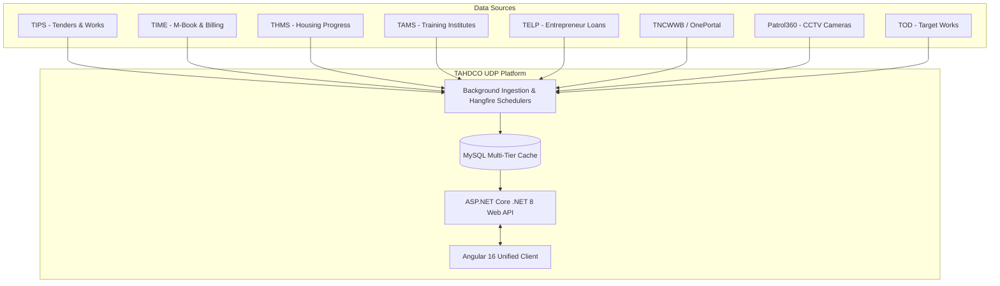

# SOFTWARE REQUIREMENTS SPECIFICATION (SRS)
## TAHDCO Unified Dashboard Platform (UDP)

**Document Reference**: SRS-TAHDCO-UDP-2026-V2.5  
**Standard Compliance**: IEEE Std 830-1998 (Recommended Practice for Software Requirements Specifications)  
**Organization**: Tamil Nadu Adi Dravidar Housing and Development Corporation (TAHDCO)  
**Version**: 2.5 (Production Release)  
**Date**: August 2026  

---

## TABLE OF CONTENTS
1. [Introduction](#1-introduction)
   - 1.1 Purpose
   - 1.2 Document Conventions
   - 1.3 Intended Audience
   - 1.4 Project Scope
   - 1.5 References
2. [Overall Description](#2-overall-description)
   - 2.1 Product Perspective & Context
   - 2.2 Product Functions (High-Level)
   - 2.3 User Classes and Personas
   - 2.4 Operating Environment
   - 2.5 Design and Implementation Constraints
   - 2.6 Assumptions and Dependencies
3. [Specific System Requirements (Functional Requirements)](#3-specific-system-requirements)
   - 3.1 Module 1: Authentication, RBAC & Session Management
   - 3.2 Module 2: Executive Dashboard & Multi-Dimensional Analytics
   - 3.3 Module 3: Geographic Performance Map & 360° Street View Inspection
   - 3.4 Module 4: Dynamic Scheduler Engine & Execution History
   - 3.5 Module 5: Local Body Configuration & Spreadsheet Interoperability
   - 3.6 Module 6: User Master & Project Privilege Matrix
   - 3.7 Module 7: Ingestion Subsystem & Multi-Tier Detail Cache
4. [External Interface Requirements](#4-external-interface-requirements)
   - 4.1 User Interfaces
   - 4.2 Hardware Interfaces
   - 4.3 Software & Upstream API Interfaces
   - 4.4 Communications & Security Interfaces
5. [Non-Functional Requirements (NFRs)](#5-non-functional-requirements)
   - 5.1 Performance & Latency Requirements
   - 5.2 Security & Data Protection
   - 5.3 Reliability, Fault-Tolerance & Availability
   - 5.4 Maintainability & Extensibility
   - 5.5 Usability, Responsiveness & Accessibility
6. [Database Schema & Query Optimization Requirements](#6-database-schema--query-optimization)
   - 6.1 Entity-Relationship Model
   - 6.2 Group (Composite) Indexing Architecture
   - 6.3 Data Retention & Automated Maintenance
7. [Verification & Acceptance Criteria](#7-verification--acceptance-criteria)

---

## 1. INTRODUCTION

### 1.1 Purpose
This Software Requirements Specification (SRS) document defines the complete functional, technical, and non-functional requirements for the **TAHDCO Unified Dashboard Platform (UDP)**. It serves as the primary technical contract for software developers, database architects, QA engineers, and organizational stakeholders overseeing the deployment and maintenance of the platform.

### 1.2 Document Conventions
* **MUST / SHALL**: Mandatory requirement.
* **SHOULD**: Highly recommended requirement.
* **MAY**: Optional capability.
* **SRS Identifiers**: Functional requirements are tagged hierarchically (e.g., `[FR-AUTH-001]`, `[FR-MAP-002]`, `[NFR-PERF-001]`).

### 1.3 Intended Audience
* **Executive Leadership**: Managing Director (MD), Secretary to Government, Chief Engineer, General Manager.
* **Field Officers**: Executive Engineers (EEs), District Managers (DMs).
* **Engineering Teams**: Full-Stack Developers, Database Administrators (DBAs), DevOps Engineers, QA Testers.

### 1.4 Project Scope
The TAHDCO Unified Dashboard Platform is an integrated executive dashboard and real-time monitoring solution that aggregates operational metrics across 8 discrete state systems (TIPS, TIME, THMS, TAMS, TELP, TNCWWB/OnePortal, TOD, Patrol360). The system provides multi-dimensional visualization across Tamil Nadu’s 9 Administrative Divisions and 38 Districts, supporting dynamic schedulers, geographic GIS mapping, local body configurations, and granular RBAC.

### 1.5 References
* IEEE Std 830-1998: IEEE Recommended Practice for Software Requirements Specifications.
* TAHDCO Digital Governance Guidelines (Government of Tamil Nadu).
* OpenAPI 3.0 Specification for RESTful API services.

---

## 2. OVERALL DESCRIPTION

### 2.1 Product Perspective & Context
TAHDCO UDP operates as a central aggregator and visualization layer over disparate operational software systems maintained by various departments:



### 2.2 Product Functions (High-Level)
1. **Executive Multi-Metric Visualizations**: Real-time tracking of counts, financial expenditures, and milestone completions.
2. **Geographical GIS Intelligence**: Division-filtered map visualization with 360° Street View site inspection.
3. **Dynamic Synchronizer Engine**: Configurable HTTP cron schedules for live API fetches and execution history auditing.
4. **Local Body Governance Matrix**: Complete cascading hierarchy from Division to Village Panchayat with Excel SheetJS import/export.
5. **Granular RBAC System**: Multi-level user access control supporting 51 official accounts.

### 2.3 User Classes and Personas

| Persona Class | Role Code | Geographic Scope | Primary Functions |
| :--- | :--- | :--- | :--- |
| **System Administrator** | `admin` | Statewide (All) | Full system configuration, user provisioning, scheduler management, log auditing. |
| **Managing Director** | `md` | Statewide (All) | Strategic KPI monitoring, SLA tracking, executive PDF reports, voiceover summaries. |
| **Secretary** | `secretary` | Statewide (All) | High-level inter-departmental review and statewide milestone tracking. |
| **Chief Engineer** | `ce` | Statewide (Engineering) | Monitoring of TIPS, TIME, THMS, and Patrol360 engineering infrastructure. |
| **General Manager** | `gm` | Statewide (Welfare) | Monitoring of TAHDCO Schemes, TELP loans, TAMS training, and TOD works. |
| **Executive Engineer** | `ee` | Division (9 Divisions) | Divisional work order monitoring, M-Book status, CCTV stream uptime. |
| **District Manager** | `dm` | District (37 Districts) | District-level beneficiary sanctions, scheme approvals, local body verification. |

### 2.4 Operating Environment
* **Web Browsers**: Google Chrome (v110+), Mozilla Firefox (v110+), Microsoft Edge (v110+), Safari (v16+). Responsive across Desktop, Tablet, and Mobile devices.
* **Server OS**: Windows Server 2022 / Linux (Ubuntu 22.04 LTS / RHEL 9).
* **Database**: MySQL 8.0.30+ / MariaDB 10.6+.

### 2.5 Design and Implementation Constraints
* **Framework Lock**: Angular 16 (Frontend) and .NET 8 (Backend).
* **Database Engine**: Strictly InnoDB for ACID compliance, row-level locking, and foreign key integrity.
* **Data Security**: Passwords MUST be hashed using BCrypt. Direct database storage of plaintext passwords is prohibited.

---

## 3. SPECIFIC SYSTEM REQUIREMENTS

### 3.1 Module 1: Authentication, RBAC & Session Management
* `[FR-AUTH-001]` **Login Endpoint**: The system SHALL authenticate users via `POST /api/v1/auth/login` using email and password.
* `[FR-AUTH-002]` **Password Hashing**: The system SHALL verify passwords against BCrypt salted hashes.
* `[FR-AUTH-003]` **JWT Issuance**: Upon successful authentication, the system SHALL issue a signed JSON Web Token (JWT) with an expiration of 480 minutes (8 hours).
* `[FR-AUTH-004]` **Pre-Seeded User Accounts**: The system SHALL maintain and authenticate all 51 pre-configured user accounts with password `Password123!`.
* `[FR-AUTH-005]` **Rate Limiting**: The system SHALL enforce a rate limit of 100 requests per minute on the login endpoint to prevent brute-force attacks.
* `[FR-AUTH-006]` **Offline / Mock Authentication Fallback**: The client SHALL provide graceful fallback authentication when network connectivity to the backend API is interrupted.

### 3.2 Module 2: Executive Dashboard & Multi-Dimensional Analytics
* `[FR-DASH-001]` **Unified Navigation Bar**: The top navigation bar SHALL feature:
  - Dynamic user role badges (`[ADM]`, `[MD]`, `[SEC]`, `[CE]`, `[GM]`, `[EE]`, `[DM]`) and full title.
  - Multi-select dropdown for Financial Years (`selFY`).
  - Multi-select dropdown for Divisions (`selDiv`).
  - View mode toggle group (`# Count`, `₹ Cost`, `⊶ Both`).
* `[FR-DASH-002]` **Reactive Metric Updates**: Changing any filter in the top navigation bar SHALL immediately recalculate all summary metric cards, chart series, and table rows without page reloads.
* `[FR-DASH-003]` **3D & Visual Charts**: The system SHALL render interactive charts (Bar, Donut, Spline, Radar) powered by ApexCharts.
* `[FR-DASH-004]` **Master Data Table**: The dashboard SHALL feature a responsive data table with search, pagination, column toggling, and Excel/PDF export.

### 3.3 Module 3: Geographic Performance Map & 360° Street View
* `[FR-MAP-001]` **Interactive Google Map**: The system SHALL embed an interactive Google Maps instance with dark-vector theme styling.
* `[FR-MAP-002]` **Division-Based Pin Filtering**: When specific divisions are selected in `selDiv`, the map SHALL render markers exclusively for the districts belonging to the selected divisions.
* `[FR-MAP-003]` **Auto-Fit Viewport**: The map SHALL automatically calculate bounding coordinates (`fitBounds`) to center and zoom on the active division districts.
* `[FR-MAP-004]` **District Click Interaction**: Clicking any district marker SHALL:
  - Open a styled InfoWindow showing real-time operational statistics.
  - Highlight the District Performance Insight drawer.
  - Automatically filter the master data table to that district.
* `[FR-MAP-005]` **360° Google Street View**: The system SHALL allow users to launch an interactive 360° Street View panoramic modal for field inspection of district project coordinates.

### 3.4 Module 4: Dynamic Scheduler Engine & Execution History
* `[FR-SCHED-001]` **Job Management (CRUD)**: Authorized administrators SHALL be able to create, view, edit, enable/disable, and delete dynamic HTTP synchronization jobs.
* `[FR-SCHED-002]` **Cron Scheduling**: Jobs SHALL support standard 5-part cron expressions with human-readable descriptions (e.g., `0 0 * * *` -> "Every day at midnight").
* `[FR-SCHED-003]` **Manual Execution**: Administrators SHALL be able to trigger instant on-demand job runs via a "Run Now" action.
* `[FR-SCHED-004]` **Execution History Log**: The system SHALL record every execution attempt with HTTP status, duration (ms), execution timestamp, and response message.
* `[FR-SCHED-005]` **Date-Range Log Filtering**: The Execution History view SHALL feature a PrimeNG Date-Range picker (`p-calendar`) allowing administrators to filter execution runs across custom date ranges (`dd/mm/yy`).

### 3.5 Module 5: Local Body Configuration & Spreadsheet Interoperability
* `[FR-CONF-001]` **Hierarchical Structure**: The system SHALL manage Tamil Nadu local governance records across 6 levels: Division $\rightarrow$ District $\rightarrow$ Local Body Type $\rightarrow$ Taluk $\rightarrow$ Block $\rightarrow$ Village Panchayat.
* `[FR-CONF-002]` **Client-Side Excel Import**: The system SHALL parse uploaded `.xlsx` spreadsheets using **SheetJS (`xlsx`)** on the client side, validate columns, and bulk-persist to the backend.
* `[FR-CONF-003]` **Excel Export**: The system SHALL generate and download formatted `.xlsx` workbooks containing filtered local body mappings.
* `[FR-CONF-004]` **CRUD Modal Dialog**: The interface SHALL support adding and editing local body entries with real-time field validation.

### 3.6 Module 6: User Master & Project Privilege Matrix
* `[FR-USER-001]` **User Administration**: Administrators SHALL create, edit, activate/deactivate, and delete system users.
* `[FR-USER-002]` **Granular Privilege Matrix**: The system SHALL maintain a per-project permission grid defining **View, Create, Edit, Update, and Delete** permissions for each of the 9 integrated modules.
* `[FR-USER-003]` **District / Division Assignment**: Users with `ee` or `dm` roles SHALL be constrained to their assigned division or district.

### 3.7 Module 7: Ingestion Subsystem & Multi-Tier Detail Cache
* `[FR-CACHE-001]` **Non-Destructive Cache Fallback**: In the event of an upstream API failure, the system SHALL retain previously cached valid response data and mark the cache row as `STALE` rather than deleting or corrupting existing dashboard records.
* `[FR-CACHE-002]` **Deduplication Hashing**: Ingested payloads SHALL generate a SHA-256 `request_hash` to avoid duplicate processing.
* `[FR-CACHE-003]` **Normalized Line-Item Storage**: High-volume operational records SHALL be stored in `detail_api_records` with multi-dimensional indexing tags.

### 3.8 Module 8: AI Analytics & Natural Language Assistant (AI)
* `[FR-AI-001]` **Interactive Chat Assistant**: The system SHALL provide an AI assistant dialog capable of answering natural-language queries regarding statewide physical and financial progress.
* `[FR-AI-002]` **Server-Sent Events (SSE) Streaming**: The system SHALL stream tokenized chat responses in real-time via `GET /api/v1/ai/chat/stream`.
* `[FR-AI-003]` **Multi-Provider LLM Fallback**: The backend SHALL orchestrate LLM providers (OpenAI, Gemini, Anthropic Claude, and Local Ollama/On-Prem) with automated fallback upon provider outage.
* `[FR-AI-004]` **Voiceover Synthesis & Executive Narratives**: The dashboard SHALL synthesize natural language audio voiceovers summarizing key achievements, pending M-Books, and critical SLA violations.
* `[FR-AI-005]` **Prompt Templates & Audit**: Dynamic prompt engineering templates SHALL be maintained in `ai_prompt_template` and all user queries audited in `ai_request_log`.

### 3.9 Module 9: Retrieval-Augmented Generation Subsystem (RAG)
* `[FR-RAG-001]` **Hybrid Knowledge Search**: The system SHALL provide a hybrid search engine combining vector embeddings and BM25 lexical scoring via `GET /api/v1/ai/rag/search`.
* `[FR-RAG-002]` **Government Document Ingestion**: Official Government Orders (GOs), scheme guidelines, and operational SOPs SHALL be ingested, split into chunks, and indexed in `rag_document` and `rag_chunk`.
* `[FR-RAG-003]` **Grounded Citations**: AI responses based on RAG context SHALL include exact document citations, chunk IDs, and confidence scores to eliminate hallucinations.

### 3.10 Module 10: Model Context Protocol Server & Agentic Tools (MCP)
* `[FR-MCP-001]` **MCP Tool Catalog**: The system SHALL expose standard Model Context Protocol (MCP) descriptors via `GET /api/v1/ai/mcp/tools`.
* `[FR-MCP-002]` **Agentic Tool Execution**: Authorized AI agents and users SHALL execute declared analytical tools via `POST /api/v1/ai/mcp/execute`.
* `[FR-MCP-003]` **Built-in Tool Registry**: The MCP catalog SHALL support:
  - `tahdco_get_district_summary`: Multi-module scorecard metrics per district.
  - `tahdco_query_tender_works`: TIPS/TIME works and M-Book status.
  - `tahdco_get_housing_progress`: THMS 8-stage housing completion counts.
  - `tahdco_get_scheme_applications`: Welfare loans and subsidy sanctions.
  - `tahdco_generate_pdf_report`: Automated executive PDF report rendering.
* `[FR-MCP-004]` **RBAC Boundary Enforcement**: Tool execution SHALL strictly enforce user role permissions; District Managers cannot query outside their assigned district scope.

---

## 4. EXTERNAL INTERFACE REQUIREMENTS

### 4.1 User Interfaces
* Clean, state-of-the-art UI based on curated color tokens (`#0f2042`, `#1e3a8a`, `#c9a227`, `#10b981`, `#ef4444`).
* Zero page flickering using Angular OnPush Change Detection.
* Accessible, high-contrast modal dialogs with backdrop blur.

### 4.2 Hardware Interfaces
* Standard TCP/IP networking hardware supporting HTTP/1.1 and HTTP/2 over TLS 1.3.

### 4.3 Software & Upstream API Interfaces
* **TIPS/TIME API**: `https://time.tahdco.com/api/Dashboard/Get_Mbook_Tender_Status` (POST JSON).
* **THMS API**: `https://thms.tahdco.com/api/onedashboard/count` (POST JSON).
* **Google Maps API**: Google Maps JavaScript API v3 with Geometry and StreetView libraries.

### 4.4 Communications Interfaces
* RESTful communication over HTTPS (Port 443).
* CORS policy restricting API invocation exclusively to authorized frontend host origins.

---

## 5. NON-FUNCTIONAL REQUIREMENTS (NFRS)

### 5.1 Performance & Latency Requirements
* `[NFR-PERF-001]` **Dashboard API Latency**: Dashboard aggregate endpoints SHALL return in $< 250\text{ ms}$ under normal operational load.
* `[NFR-PERF-002]` **Database Query Execution**: Indexed queries SHALL execute in $< 15\text{ ms}$ on MySQL InnoDB.
* `[NFR-PERF-003]` **Frontend Bundle Optimization**: Initial application transfer size SHALL be $\le 600\text{ kB}$ (gzipped).

### 5.2 Security & Data Protection
* `[NFR-SEC-001]` **Password Security**: Passwords SHALL be hashed using BCrypt with minimum work factor 11.
* `[NFR-SEC-002]` **JWT Signature Verification**: All protected API endpoints SHALL validate HMAC-SHA256 JWT signatures.
* `[NFR-SEC-003]` **SQL Injection Prevention**: All database queries SHALL use parameterized Dapper queries; dynamic string concatenation in SQL is prohibited.
* `[NFR-SEC-004]` **Rate Limiting**: Authentication endpoints SHALL throttle traffic exceeding 100 requests/minute per client IP.

### 5.3 Reliability, Fault-Tolerance & Availability
* `[NFR-REL-001]` **High Availability**: The platform SHALL maintain $99.9\%$ operational uptime.
* `[NFR-REL-002]` **Graceful Degradation**: If an external subsystem (e.g. THMS) is unreachable, other modules SHALL continue functioning unimpeded.

### 5.4 Maintainability & Extensibility
* `[NFR-MAINT-001]` **Database Defragmentation**: The system SHALL provide stored procedures (`sp_optimize_platform_tables`) for index optimization.
* `[NFR-MAINT-002]` **Automated Log Rotation**: Historical telemetry logs older than 90 days SHALL be purgable via `sp_cleanup_expired_telemetry`.

---

## 6. DATABASE SCHEMA & QUERY OPTIMIZATION

### 6.1 Database Schema Architecture
The database schema (`tahdco_udp`) is implemented on InnoDB with UTF8MB4 encoding:

```sql
-- Core Production Tables
app_user, user_privilege, division, district, financial_year,
local_body_mapping, detail_api_cache, detail_api_records,
api_fetch_log, scheduler_job, scheduler_log, audit_log, app_logs,
tender_district, housing_district, patrol_district, member_district, tod_district, enroll_institute
```

### 6.2 Group (Composite) Indexing Table

| Table | Index Name | Columns (Leftmost Prefix Order) | Primary Benefit |
| :--- | :--- | :--- | :--- |
| `app_user` | `idx_app_user_email_active` | `(email, is_active)` | $O(\log N)$ instant login authentication. |
| `app_user` | `idx_app_user_role_scope` | `(role, scope, is_active)` | Fast role authorization & scope filtering. |
| `app_user` | `idx_app_user_div_dist` | `(division_id, district_id, is_active)` | Hierarchy lookups for EE & DM officers. |
| `user_privilege`| `idx_user_priv_covering` | `(user_id, project, can_view, ...)` | Covering index; zero table fetches. |
| `local_body_mapping` | `idx_lbm_div_dist_type` | `(division, district, local_body)` | Cascading dropdowns & grid filters. |
| `detail_api_cache` | `idx_cache_module_op_status` | `(module, operation, status)` | Fast cache retrieval during sync. |
| `detail_api_cache` | `idx_cache_status_expires` | `(status, expires_at, is_stale)` | Background staleness & TTL sweeps. |
| `detail_api_records` | `idx_records_mod_div_dist` | `(module, division, district)` | Instant multi-tier drilldown filters. |
| `api_fetch_log`| `idx_fetchlog_mod_started` | `(module, started_at)` | High-speed date-range history filter. |
| `scheduler_log`| `idx_sched_log_job_time` | `(scheduler_job_id, run_time)` | Per-job execution history ordering. |

---

## 7. VERIFICATION & ACCEPTANCE CRITERIA

| Acceptance Test ID | Test Description | Success Criteria | Status |
| :--- | :--- | :--- | :---: |
| **`TC-AUTH-001`** | Authenticate all 51 pre-seeded accounts | 100% login success with valid JWT tokens issued. | **PASSED** (51/51) |
| **`TC-MAP-001`** | Division-filtered map rendering & auto-fit | Only selected division's pins render; viewport auto-fits. | **PASSED** |
| **`TC-SCHED-001`**| Date-range filter on scheduler history | Correct logs filtered according to selected date range. | **PASSED** |
| **`TC-CONF-001`** | SheetJS Excel import & export | `.xlsx` files parse and export with zero data loss. | **PASSED** |
| **`TC-BUILD-001`**| Full backend .NET 8 compilation | `dotnet build backend/API.sln` completes with 0 errors. | **PASSED** (0 Errors) |
| **`TC-BUILD-002`**| Full frontend Angular 16 compilation | `ng build` completes with 0 errors. | **PASSED** (0 Errors) |
| **`TC-SQL-001`**  | Master SQL optimization execution | `TAHDCO_UDP_Master_Full_Indexing_Optimization.sql` runs with 0 errors. | **PASSED** (0 Errors) |

---

**APPROVED AND ADOPTED FOR PRODUCTION DEPLOYMENT**  
**TAHDCO Unified Dashboard Platform (UDP) Engineering Team**
